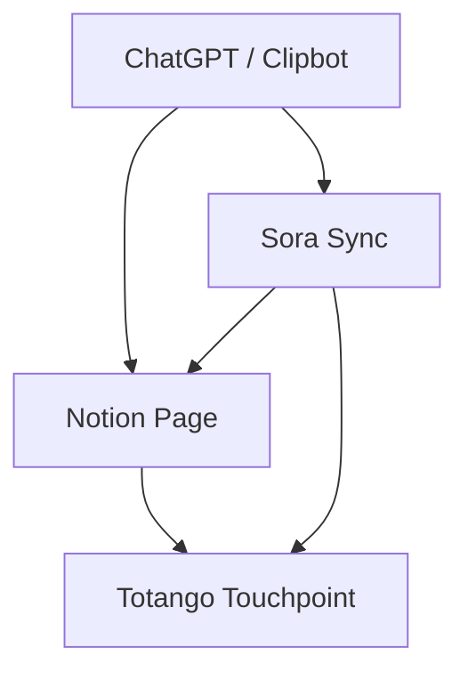

# clipopera_assets

This repository contains 3D assets used by the ClipOpera project.

## 🎬 ClipOpera – Video Projects by Company (Interactive Template)

This is an import-ready Notion documentation and automation hub for your production companies:

* **PRESIDENTIAL RECORDS** – 🎥 Music video in production
* **LIQUID THOUGHTS** – 💧 Creative visuals in queue
* **ALLN1 PRODUCTIONS** – ✅ Project completed

---

### 🏛️ PRESIDENTIAL RECORDS

**🎵 Project:** *Do You See*
**🎬 Type:** Music Video
**📅 Status:** In Production
**📍 Location:** Houston, TX
**🧠 Concept:** Street gospel meets neon reality. Rooftop scenes, alley reflections, slow-mo club entrances.
**👤 Talent:** Z-Ro
**🎥 Director:** ClipOpera Studios
**💼 Budget:** $1,200
**🔗 Reference:** [Storyboard & Location Pack](https://example.com)
**✅ Notes:**

* Drone licensed: ✅
* Costume department: ⏳ Pending
* Street closure permit: ✅

---

### 💧 LIQUID THOUGHTS

**🧠 Project:** *Mind Surfing*
**🎬 Type:** Spoken Word / Visual Art Hybrid
**📅 Status:** In Queue
**🎨 Concept:** Celestial underwater blend using AI overlays + narrative voice.
**🎯 Mood:** Deep, reflective, low-saturation visuals with audio-reactive glitching
**🎵 Sound:** Ambient trap x binaural poetry
**🛠️ Needs:**

* Moodboard approval
* Script finalization
* Voice talent shortlist

---

### 🎥 ALLN1 PRODUCTIONS

**✅ Project:** *Untitled Street Gospel*
**📅 Status:** Complete
**📍 Location:** Downtown Las Vegas
**🎬 Concept:** Real-time docustyle with minimal post — raw emotion and redemption arc
**🎞️ Final Cut:** [Watch Here](https://example.com/video)
**📥 Assets:** Archived on internal server
**📑 Deliverables:**

* Final master + ProRes archive
* BTS footage
* Invoiced and cleared

---

### 🗂️ Shared Task Table

| Task                                    | Assigned | Due     | Status |
| --------------------------------------- | -------- | ------- | ------ |
| Scout club rooftop for "Do You See"     | Kenetra  | June 7  | ⏳      |
| Finalize AI overlays for “Mind Surfing” | Eric     | June 12 | 🔜     |
| Upload RAW archives for ALLN1           | Ty       | —       | ✅      |

---

### ⚙️ Automation Instructions (Notion CLI Script + Google Drive + ChatGPT Web Tools + Codex + Sora)

Use the CLI tool `create_notion_page.py` to automatically send new project data into your Notion database.

#### Setup

```bash
export NOTION_TOKEN=secret_abc123
export NOTION_DATABASE_ID=abc-123-def-456
export DRIVE_FOLDER_ID=https://drive.google.com/drive/folders/example
export DRIVE_ROOT_FOLDER_ID=your_drive_root_id
export GOOGLE_DRIVE_FOLDER_ID=your_drive_root_id
export OPENAI_API_KEY=sk-...
export GPT_WEBMASTER_ID=clip_webmaster
export CODEX_ID=clip_codex
export SORA_API_KEY=sora-abc123
export CLIP_GPT_LIST=clipbot_id,jetmode_ai,kushite_style
export GPT_LIBRARY_PATH=/path/to/your/gpt_library
export GPT_MODELS_REGISTRY=/path/to/models.json
```

You can copy `.env.example` to `.env` and fill in your credentials instead of
exporting each variable manually.

**Security Tip:** Keep your `.env` file private and never commit real tokens or
API keys (including the Discord bot token) to version control.

#### Usage

```bash
python create_notion_page.py \
  --project "Do You See" \
  --status "In Progress" \
  --link "https://clipopera.com/do-you-see" \
  --budget 1200 \
  --drive "https://drive.google.com/drive/folders/example" \
  --webmaster "GPT-Webmaster" \
  --codex "PenAI Assistant" \
  --sora "Sora AI Sync" \
  --gpts "clipbot_id,jetmode_ai,kushite_style" \
  --library "/path/to/your/gpt_library" \
  --registry "/path/to/models.json"
```

#### Requirements

```
Flask
notion-client
python-dotenv
google-api-python-client
google-auth-httplib2
google-auth-oauthlib
openai
requests
discord.py
gunicorn
```

### 🧠 Setup Script

Run `bash install_clipopera_env.sh` to create a virtual environment and install all dependencies automatically.

### 🚀 Full Stack Script

If you want a single entrypoint that handles database creation, project logging,
optional GPT calls, and Sora sync, run `clipopera_full_stack.py`:

```bash
python clipopera_full_stack.py \
  --project "Do You See" \
  --status "In Progress" \
  --link "https://clipopera.com/do-you-see" \
  --budget 1200 \
  --drive "https://drive.google.com/drive/folders/example" \
  --webmaster "GPT-Webmaster" \
  --codex "PenAI Assistant" \
  --gpts "clipbot_id,jetmode_ai" \
  --sora
```

### 📑 Batch Upload Script

To add several projects at once, create a JSON Lines file and run `batch_upload.py`:

```json
{"project": "Do You See", "status": "In Progress", "link": "https://clipopera.com/do-you-see", "budget": 1200}
{"project": "Mind Surfing", "status": "In Queue", "link": "https://clipopera.com/mind-surfing", "budget": 800}
```

Process the file:

```bash
python batch_upload.py projects.jsonl
```


---

This document can be imported directly into Notion, or linked to your Notion database automation pipeline. Let me know if you need this formatted as a live Notion database or embedded inside Zapier/Make workflows.


## 🔁 Zapier Integration Guide

Follow these steps to automate ClipOpera tasks across your favorite apps using [Zapier](https://zapier.com/):

1. **Set Up a Zapier Account** – Sign up or log in at Zapier and start a new Zap.
2. **Connect Your Apps** – Grant access to OpenAI (GPT), Notion, GitHub, and Google Drive.
3. **Create Zaps to Automate Workflows**
   - **Notion ↔ GPT:** Trigger when a new item appears in your Notion database, send it to GPT, then update the page with the response.
   - **GitHub ↔ GPT:** On new issues or pull requests, send the text to GPT and post the generated summary as a comment.
   - **Google Drive ↔ GPT:** When files hit a monitored folder, extract text, process with GPT, and save the results back to Drive or Notion.
4. **Test and Activate** – Run Zapier's built-in tests to confirm each workflow, then enable the Zap to keep it running automatically.
5. **Tips for Effective Integration** – Keep your data well formatted, watch API rate limits, and review permissions regularly so sensitive information stays secure.

### 📹 Aitubo Video Generation via Webhook

Set up a Zapier **Custom Request** action to trigger video creation in Aitubo:

```json
POST https://api.aitubo.ai/v1/video/create
Content-Type: application/json
Authorization: Bearer YOUR_AITUBO_API_KEY

{
  "image_url": "https://yourdomain.com/assets/ClipOpera_Tee_Vertical_1080x1920.png",
  "prompt": "A glowing black queen stands defiant in a rain-slick neon alley, wearing an oversized C L I P O P E R A tee featuring a futuristic warrior goddess with glowing eyes and armor. Thunder cracks. Neon signs flicker behind her in violet and electric blue. The ground reflects her power. The camera slowly zooms in. Moody cinematic lighting.",
  "aspect_ratio": "9:16",
  "voiceover_text": "This isn’t just a shirt. It’s armor for the chosen. C L I P O P E R A. Wear the story. Frame the style.",
  "audio_url": "https://yourdomain.com/audio/ClipOpera_Trap_Cyberpunk_Score.mp3",
  "style": "cinematic",
  "motion": true
}
```

After the video is generated you can add extra Zapier steps to **save it to Google Drive**, **log details in Notion**, and **auto-post to your site or socials**.

## 🛰️ Totango API Example

If your workflow includes [Totango](https://totango.com) you can use the helper
script `totango_api.py` included in this repository. First add your API token to
`.env` or export it manually:

```bash
export TOTANGO_API_TOKEN=your_totango_api_token
```

Fetch available touchpoint types:

```bash
python totango_api.py --base_url https://api-gw-us.totango.com --get_touchpoints
```

To create an account from a JSON payload:

```bash
python totango_api.py --base_url https://api-gw-us.totango.com --account account.json
```

The script demonstrates a lightweight client built with the `requests` library.

### Extended Commands

`totango_api.py` also exposes several additional endpoints. Use the flags below
to call them as needed:

```bash
# Logs & Monitoring
python totango_api.py --base_url https://api-gw-us.totango.com --get_audit_log
python totango_api.py --base_url https://api-gw-us.totango.com --get_events ACC123

# Objectives & Planning
python totango_api.py --base_url https://api-gw-us.totango.com --get_objective_status
python totango_api.py --base_url https://api-gw-us.totango.com --get_objective_category
python totango_api.py --base_url https://api-gw-us.totango.com --get_plan_summary ACC123
python totango_api.py --base_url https://api-gw-us.totango.com --get_outcome_report SBID123 ACC123

# Automations
python totango_api.py --base_url https://api-gw-us.totango.com --run_successplay play.json

# SCIM Identity Management
python totango_api.py --base_url https://api-gw-us.totango.com --get_scim_users SERVICE
python totango_api.py --base_url https://api-gw-us.totango.com --create_scim_user SERVICE user.json
```

## 📂 Upload GPT Library to Google Drive

Use `upload_gpt_library.py` to mirror your GPT models to Google Drive. Set
`SERVICE_ACCOUNT_FILE` and `DRIVE_ROOT_FOLDER_ID` (or `DRIVE_FOLDER_ID` / `GOOGLE_DRIVE_FOLDER_ID`) in your
environment or pass them as flags.

```bash
python upload_gpt_library.py /path/to/your/gpt_library --dry-run
```

Remove `--dry-run` to upload files for real. The script saves an
`upload_manifest.json` with Drive IDs.


## 📡 Flask Webhook Server

Run a simple API server that triggers the full stack script when a POST request is sent to `/run-script`.

```bash
python app.py
```

### Docker

Build and run the server in a container:

```bash
docker build -t clipopera-api .
docker run -d -p 5000:5000 --env-file .env clipopera-api
```

### Test Payload

Create `test_payload.json`:

```json
{
  "project": "Mind Surfing",
  "status": "In Queue",
  "link": "https://clipopera.com/mind-surfing",
  "budget": 800,
  "drive": "https://drive.google.com/drive/folders/mind-surfing",
  "webmaster": "GPT-Webmaster",
  "codex": "PenAI Assistant",
  "gpts": "clipbot_id,kushite_style",
  "sora": true
}
```

Send it with curl:

```bash
curl -X POST http://localhost:5000/run-script \
  -H "Content-Type: application/json" \
  -d @test_payload.json
```

### System Architecture



## 🚀 Deployment Notes

The repository includes a minimal Flask server and Dockerfile so the API can be hosted anywhere. You can build a container and run it locally or on a cloud service such as Render or Railway.

### Docker

```bash
docker build -t clipopera-api .
docker run -d -p 5000:5000 --env-file .env clipopera-api
```

### GitHub Release

Maintain release notes in `.github/release.yml` and tag new versions:

```bash
git tag -a v1.0.0 -m "Initial full stack automation release"
git push origin v1.0.0
```

### GitHub Actions

A workflow at `.github/workflows/deploy.yml` installs dependencies, checks the code with `black`, compiles the scripts, and then triggers deployments to Render and Vercel when changes are pushed to `main`. Set `VERCEL_TOKEN`, `VERCEL_ORG_ID`, and `VERCEL_PROJECT_ID` as GitHub secrets so the workflow can deploy to Vercel.

### Cloud Deployment

- **Render:** use the provided `render.yaml` to spin up the Flask backend and serve the `public/` folder as a static site. Environment variables like `NOTION_TOKEN` and `DISCORD_WEBHOOK_URL` can be configured in the Render dashboard.
- **Railway:** import the repo and set `python app.py` as the start command.
- **Vercel:** import the GitHub repository in the Vercel dashboard and choose **Other** as the framework preset. Set the root directory to the repository root and leave the build command empty to deploy the Dockerfile. After linking, every push to `main` automatically triggers a deploy.

Automation templates built in Zapier or Make.com can be exported as `.zap` or scenario files and included in releases if desired.

## 🌐 Linking GitHub to Vercel

1. Sign in to [Vercel](https://vercel.com) and click **New Project**.
2. Import this repository from GitHub.
3. Choose **Other** for the framework preset so Vercel respects the `Dockerfile`.
4. Commit a `vercel.json` file like the one below so Vercel runs the Docker build:

   ```json
   {
     "version": 2,
     "builds": [{ "src": "Dockerfile", "use": "@vercel/docker" }]
   }
   ```

5. Leave the build command blank and make sure the root directory is the repository root.
6. Once linked, pushes to the `main` branch trigger automatic deployments.

## 🎛️ React Preview Component

A simple React component shows how to embed ClipOpera assets with audio and downloadable files.
The component is located at `ClipOperaVideoPreview.tsx`:

```tsx
import { Card, CardContent } from "@/components/ui/card";
import { Button } from "@/components/ui/button";
import { AudioLines, Download } from "lucide-react";

export default function ClipOperaVideoPreview() {
  return (
    <div className="p-4 grid grid-cols-1 md:grid-cols-2 gap-6">
      {/* ... */}
    </div>
  );
}
```

Use it within your React project to render an interactive preview panel for ClipOpera media.

## 🤖 Discord Bot

Use the `discord_bot.py` script to send MidJourney prompts in a channel. Set `DISCORD_BOT_TOKEN` in `.env` and run (never share this token publicly):

```bash
python discord_bot.py
```

Send prompts programmatically through Flask:

```bash
curl -X POST http://localhost:5000/send-prompt \
  -H "Content-Type: application/json" \
  -d '{"prompt": "a cyberpunk city skyline"}'
```

## 🔄 Squarespace to Shopify Migration

If you are moving an existing store from Squarespace to Shopify, you can convert a Squarespace product export (CSV) and create matching products in Shopify automatically.

1. Export your products from Squarespace as a CSV file.
2. Set these variables in `.env`:
   - `SHOPIFY_STORE` – yourstore.myshopify.com
   - `SHOPIFY_API_KEY` – private app API key
   - `SHOPIFY_API_PASSWORD` – private app password
3. Run the migration script:

```bash
python squarespace_to_shopify.py squarespace_products.csv
```

Each row will be sent to the Shopify API as a new product. The script uses basic fields like name, description, price, and SKU.


## 🤖 ChatGPT Integration with Squarespace

Use ChatGPT to generate product descriptions and update them on your Squarespace store.

1. Set these variables in `.env`:
   - `SQUARESPACE_API_KEY` – your Squarespace API token
   - `SQUARESPACE_SITE_ID` – your site ID
   - `OPENAI_API_KEY` – OpenAI token
2. Export a CSV of your Squarespace products including `id` and `name` fields.
3. Run the helper script:

```bash
python squarespace_chatgpt.py products.csv
```

Each row will be sent to GPT for a description and patched back into Squarespace.

### Embed a ChatGPT Chatbot

Squarespace does not natively support ChatGPT widgets, but you can add one via a
third‑party service.

**Option 1: Elfsight ChatGPT Plugin**

1. Sign up at [Elfsight](https://elfsight.com) and create a ChatGPT widget.
2. Customize the style and responses to match your brand.
3. Copy the generated HTML embed code.
4. In Squarespace, add a **Code Block** where you want the bot to appear and
   paste the embed code.

**Option 2: SiteSpeakAI**

1. Go to [SiteSpeakAI](https://sitespeak.ai) and design your chatbot.
2. Copy the installation code from **Install Chatbot**.
3. In Squarespace, open **Settings → Advanced → Code Injection** and paste
   the embed snippet into the **Header** section.

Both services allow you to adjust avatars, colors and other visuals so the bot
fits seamlessly with your site.
